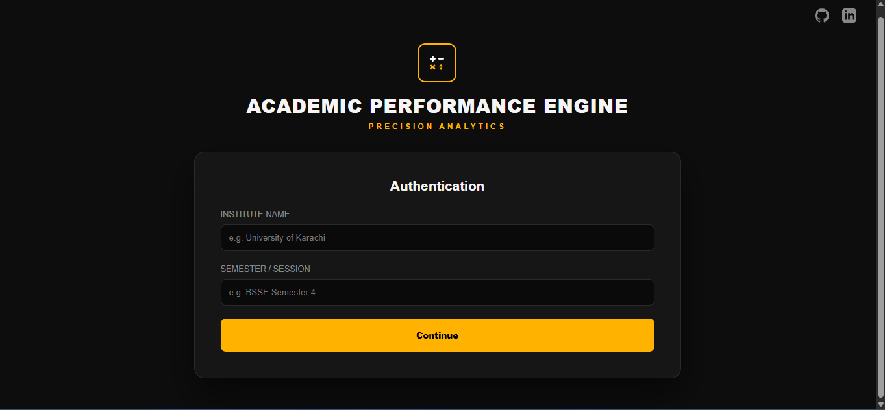
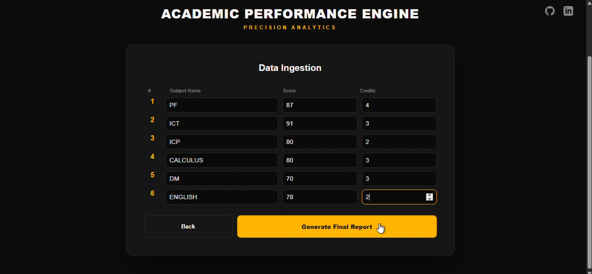
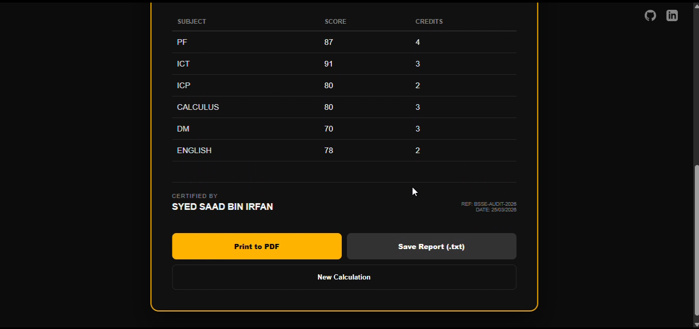
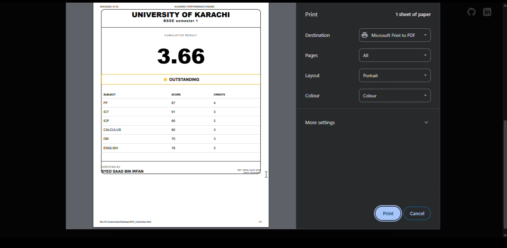

# 🎓 Academic Performance Engine (GPA Calculator)

A structured and efficient GPA Calculator designed to compute, analyze, and represent academic performance with clarity and precision.

---

##  Overview

The Academic Performance Engine is a logic-driven system that allows students to calculate their GPA using course data, credit hours, and grades.  
It simplifies complex academic calculations into a clean, user-friendly workflow while maintaining accuracy and structure.

## Deployment
You can access the live project here: [Academic Performance Engine - GPA Calculator](https://syedsaad314.github.io/Academic-Performance-Engine-GPA-Calculator-/)

  
    
  
    
  
    
  

---

## ⚙️ Core Functionality

- Input course details (subjects, grades, credit hours)  
- Compute GPA using standard academic formula  
- Process and organize academic data efficiently  
- Generate a structured performance report  

GPA is calculated using:

> GPA = (Σ (Grade Point × Credit Hours)) / (Σ Credit Hours)  

---

##  Key Features

-  Accurate GPA Calculation  
-  Structured Data Management  
-  Academic Performance Analysis  
-  Clean Report Output  
-  Simple and Intuitive Interface  

---

## 🎯 Objective

This project focuses on applying programming fundamentals to solve a real-world academic problem by combining:

- Logical computation  
- Clean structure  
- User-friendly interaction  

---

**Developed and Engineered by Syed Saad Bin Irfan**
BS Software Engineering Student

---

##  Final Note

This is not just a calculator — it is a **structured academic performance system** that demonstrates how programming can transform everyday tasks into efficient tools.
